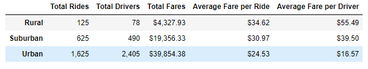

# PyBer Rideshare Data Analysis
## Overview of Analysis

### CEO of ridesharing app PyBer, V. Isualize, has asked us to analyze a set of data created by the rideshare app. She would like us to review the data and bring her suggestions for improvements that might be made to PyBer.

## Rideshare Analysis Results

### After analyzing the rideshare data there are definately some conclusions we can draw. I will break down the data piece by piece and explain what we can learn from each of them.

  -  First, looking at the **Average Fare Per Ride** for the dataset, we can see that drivers in Rural cities make the most per ride on average at $34.62. They are followed by Suburban at $30.97 and Urban at $24.53. Assuming the fare rates are the same for the different city types, this means people in rural cities take longer rides on average then people in Suburban and Urban areas. Because the rides are longer in rural areas a driver needs less of them to fill their day. Because of that it might be easier for a Driver to make a living in rural areas if there are enough riders. So next let's look at the driver to rider ratios of the three city types.
  -   In rural areas, for the period of time in the dataset, PyBer's 78 drivers provided 125 rides, that's 1.6 rides per driver. In the Suburbs PyBer had 490 drivers who provided 625 rides, that's about 1.28 rides per driver, a little less then in rural areas. Urban areas had the most drivers of any city type at 2,405. Those 2,405 drivers also provided more rides in total then other areas at 1,625, but had the least rides per driver at only .68. 
  -   There were so many more rides provided in urban cities that even though drivers there were making %30 less per ride it still collected far more fares in total then any other city type with $39,854. Suburban cities brought in about half of that at $19,356. Rural cities brought in the least total fares by far with only about %25 of surban cities, or %11 of urban cities, with $4,327.
  -   Next we can look at **Average Fare Per Driver**. This is how much the average driver made in the about 4 month period of time we looked at data for. 

## Summary

  As can be seen above, /drivers per square mile of size /

