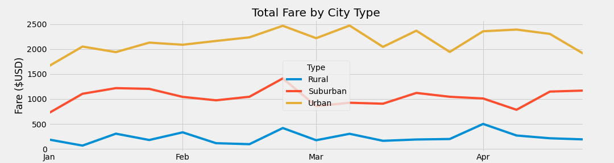

# PyBer Rideshare Data Analysis
## Overview of Analysis

### The CEO of ridesharing app PyBer, has asked us to analyze a set of data created by the rideshare app. She would like us to review the data and bring her suggestions for improvements that might be made to PyBer. 

## Rideshare Analysis Results

### After analyzing the rideshare data there are definately some conclusions we can draw. I will break down the data piece by piece and explain what we can learn from each of them. Here are the metrics I will look at: Average Fare Per Ride, Driver Count, Ride Count, Total Fares and Average Fare per Driver. I will also look at the Fare Amounts by Month per City Type. Below you will see an image displaying the first 5 metrics and values I will be covering.

  -  First, looking at the **Average Fare Per Ride** for the dataset, we can see that drivers in Rural cities make the most per ride on average at $34.62. They are followed by Suburban at $30.97 and Urban at $24.53. Assuming the fare rates are the same for the different city types, this means people in rural cities take longer rides on average then people in Suburban and Urban areas. Because the rides are longer in rural areas a driver needs less of them to fill their day. That it might be easier for a Driver to make a living in rural areas if there are enough riders. So next let's look at the driver to rider ratios of the three city types.
  -   Looking at **Driver Counts** and **Rider Counts** the data shows that in rural areas, for the period of time in the dataset, PyBer's 78 drivers provided 125 rides, that's 1.6 rides per driver. In the Suburbs PyBer had 490 drivers who provided 625 rides, that's about 1.28 rides per driver, a little less then in rural areas. Urban areas had the most drivers of any city type at 2,405. Those 2,405 drivers also provided more rides in total then other areas at 1,625, but had the least rides per driver at only .68. 
  -   When we look at **Total Fares** we see there were so many more rides provided in urban cities that even though drivers there were making %30 less per ride it still collected far more fares in total then any other city type with $39,854. Suburban cities brought in about half of that at $19,356. Rural cities brought in the least total fares by far at only about %25 of suburban cities, or %11 of urban cities, with $4,327.
  -   Next we can look at **Average Fare Per Driver**. This is how much the average driver made in the just over 4 month period of time we had data for. The data shows us that rural drivers made the most on average with $55.49. Suburban drivers were next making $39.50, and Urban drivers made the least with only $16.57 per driver. 
  -   Below you can see a graph showing us **Fare Amounts by Month per City Type**. The graph makes clear what we already saw looking at the other metrics. The majority of fare dollars are coming from urban city types, followed by suburban and finally urban. We can also see that the volume of fare dollars remained mostly consistant from week to week for  the three city types, with a small peak for all three city types the last week of February. 

## Summary

  Examining the data the way we have above I feel there are a few additional suggentions and observations I can make. One change that might be considered, if you don't already have something similar in place, is to institute minimum fare amounts. When we looked at the data we saw that people in rural areas take longer rides, but we also saw the people in urban areas take shorter rides. While the aveage ride was $16 there were certainly some rides that were much more and some that were much less. By instituting a $5-$10 minimum fare you could support more drivers in urban and maybe even suburban areas. The drivers need that support too. When we looked at the number of drivers working in your urban cities we saw that the average rides per driver was .68. Since in reality a person can not take less then a full trip this means there are drivers who never got to accept a ride and made $0. Limits could be imposed on the number of drivers that can work an area at a time. This would ensure that each driver actually got to accept rides and make money. Finally PyBer should think about cutting down it's driver count accross the board. Even rural cities where drivers accepted more then twice as many rides as urban cities, the drivers did not actually make much money bringing home only $55 for 4 months work. Not included in this data set in the amount of time each driver worked for over the 4 months, but unless they were only driving an hour or two each it seems like being a driver for PyBer would not be very profitable or enticing.

